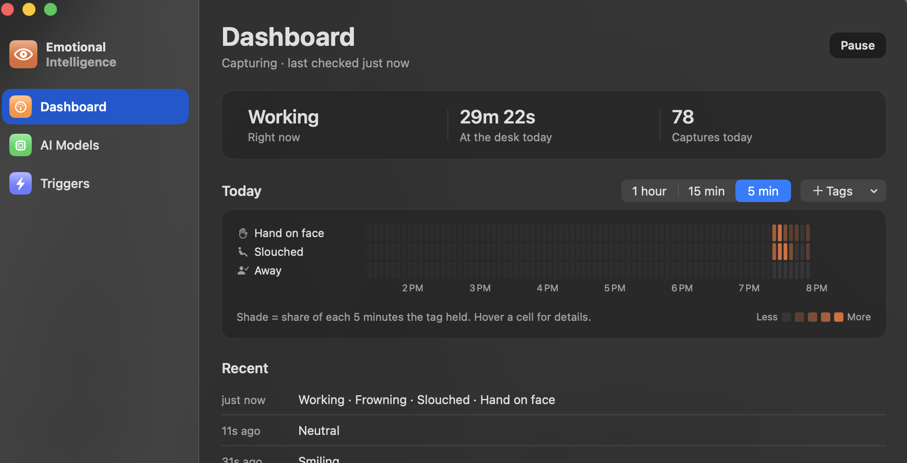
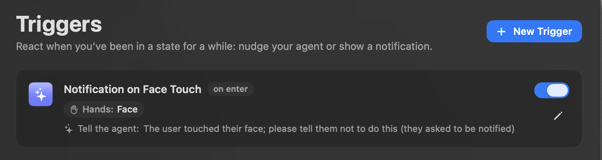
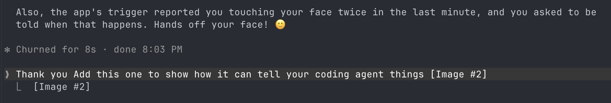

# Emotional Intelligence

The goal of this project is to give desktop agents emotional intelligence. In particular, to give them an understanding of your body language. This project runs *100% Locally* to preserve privacy. The project is a Mac Application that connects to your agents via MCP. It can push notifications to them based on your body language & can be passively queried.



### How it works
A local scheduled jobs polls the desktop camera at regular intervals. Local models describe your observable body language (expression, gaze, posture, what your hands are doing), and the results are saved in a local database. An MCP connector enables desktop agents to access the results (importantly not the images).

[Triggers](#triggers) can also push to your coding agent. For example, this one tells the agent whenever you touch your face, and the agent passes the reminder on in its next reply:



And Claude Code acting on it mid-session:



### Future work
In the future, keyboard inputs, biometrics, and an agent's own assesment of your emotional state could be included.

### Other uses
Because what's recorded is behavior rather than emotion, the same data serves other uses directly. For example, monitoring for bad posture.

### What gets recorded

Each observation is a set of facts, one value per key, drawn from small fixed vocabularies. The options are kept coarse on purpose: small local vision models are reliable at "smiling vs frowning" or "hand on face", not at "leaning forward vs upright" or "brow furrowed vs lips pressed". Any field can be left out when the model can't see it clearly.

| key          | values |
|--------------|--------|
| `present`    | `true`, `false` |
| `activity`   | `working`, `on_phone`, `eating_drinking`, `idle`, `away` |
| `gaze`       | `screen`, `away` |
| `expression` | `neutral`, `smiling`, `frowning`, `yawning` |
| `posture`    | `upright`, `slouched` |
| `hands`      | `desk`, `face`, `not_visible` |

Plus an optional one-sentence note for anything the fields miss.

## Architecture

```
                     ┌──────────────────────────────────────┐
  camera ──frame──▶  │  ei-daemon  (long-running, launchd)  │
                     │   capture → gate → analyze → write   │──▶ Ollama (localhost)
                     └──────────────┬───────────────────────┘
                                    │ single writer
                                    ▼
                           ┌─────────────────┐
                           │  ei.db (SQLite, │
                           │   WAL mode)     │
                           └──▲───────────▲──┘
                   read-only  │           │  read + settings writes
              ┌───────────────┴──┐   ┌────┴──────────────────┐
              │ ei-mcp (stdio,   │   │ desktop app (app/)    │
              │ spawned by agent)│   │                       │
              └──────────────────┘   └───────────────────────┘
```

- **`ei-daemon`** is the only process that touches the camera, the models, or the DB write path.
  A cheap **gate** (face present? frame meaningfully changed?) runs on every frame so the
  expensive vision model only sees frames worth analyzing. Time away from the desk is
  recorded by the gate alone, without running the model.
- **SQLite (WAL)** is the contract between processes. Readers never block the writer.
  Settings live in the `settings` table; the daemon notices changes within ~1s and reloads.
- **`ei-mcp`** is a thin, read-only stdio server. It deliberately avoids heavy imports
  because agents spawn it on every session.
- **Images never touch disk.** Frames live in memory only, and the daemon refuses to run
  against a non-loopback `OLLAMA_HOST`.
- **Facts are stored in an indexed key/value table**, so questions like "how long was I
  slouched in the last hour?" are a single query, and new signals need no schema change.
- **Summaries are time-weighted.** The gate skips unchanged frames, so one observation can
  stand for minutes of sitting still. Each observation counts until the next one.
- Query logic is shared in `ei/queries.py`. The MCP server and the desktop app are
  thin adapters over the same functions.


## Getting started

Requires [uv](https://docs.astral.sh/uv/) and [Ollama](https://ollama.com).

```sh
uv sync
ollama pull qwen2.5vl:7b          # or set another model: uv run ei settings ollama_model <name>

uv run ei capture-once            # one capture → gate → analyze pass, printed
uv run ei-daemon -v               # run the loop in the foreground
uv run ei tail                    # recent observations
uv run ei settings                # list settings; `ei settings interval_s 15` to change one
```


### Desktop app (macOS)

A native SwiftUI app in `app/` runs the daemon for you and gives you:
- a dashboard of recent captures (what was seen: gaze, expression, posture, hands)
- an AI Models page to download and choose local Ollama vision models
- a Triggers page to create and edit triggers
- Settings for every daemon setting

It needs macOS 15 and the Swift command-line tools; Xcode isn't required.

```sh
uv sync                              # the app runs .venv/bin/ei-daemon from this folder
app/scripts/build-app.sh             # → app/build/Emotional Intelligence.app
open "app/build/Emotional Intelligence.app"
```

**How the app works:**
- **Daemon:** the app starts `ei-daemon` as a child process and stops it on quit. Closing the window keeps capture running from the menu bar (the eye icon).
- **Camera permission:** macOS asks the app for camera access, and the daemon uses that grant.
- **Shared state:** settings and triggers go through the same SQLite tables as the CLI, so `ei settings` and `ei triggers` stay in sync with the app.
- **Trying it out:** Settings → Diagnostics → Fake mode runs without a camera or Ollama.
- **Daemon already running:** if one is running elsewhere (terminal or launchd), the app uses it instead of starting another.

### Run at login (macOS)

```sh
uv run ei launchd > ~/Library/LaunchAgents/com.emotional-intelligence.daemon.plist
launchctl load ~/Library/LaunchAgents/com.emotional-intelligence.daemon.plist
```

Camera permission on macOS is granted to the process that opens the camera. Under launchd,
that is the Python interpreter rather than your terminal, so you may need to grant it camera access in
System Settings → Privacy & Security → Camera.

### Connect an agent

Add the MCP server to your agent's config, for example `.mcp.json` for Claude Code:

```json
{
  "mcpServers": {
    "emotional-intelligence": {
      "command": "uv",
      "args": ["run", "--directory", "/path/to/emotional-intelligence", "ei-mcp"]
    }
  }
}
```

Tools:
- `current_observation()`, e.g. *"Observed 12s ago. activity: working; gaze: screen; expression: frowning; posture: upright; hands: face."*
- `recent_behavior(minutes)` gives the share of time per value, flagging changes versus the previous window, e.g. *"posture: slouched 70% (prev 20%)"*.

## Triggers

Triggers fire when observed behavior matches a rule, either on entering a state or after a state has lasted a while:

```sh
# Tell the agent when you take a drink (on entering the state), at most every 30 min
uv run ei triggers add "drink break" --when activity=eating_drinking --cooldown 30m \
  --message "User just took a drink. Good moment to pause and summarize progress."

# Desktop notification after 10 minutes of slouching
uv run ei triggers add "posture" --when posture=slouched --for 10m --notify os_notify \
  --message "You've been slouching for 10 minutes."

uv run ei triggers                  # list; also: enable / disable / rm <id>
uv run ei events                    # what fired, and whether it was delivered
```

`--when` takes `key=value[,value...]` and can be repeated; every key must match.

The daemon evaluates triggers and records fired **events**. Delivery depends on the action:
- **`os_notify`**: the daemon shows a macOS notification immediately.
- **`agent`**: a Claude Code hook (`ei-hook`) delivers the event into your agent session as context: while it's working (after its next tool call) or with your next prompt. Each event is delivered once, to whichever session gets there first. Events older than `agent_event_ttl_s` (default 5 min) are dropped rather than replayed. Register the hook by adding the output of `uv run ei hook-config` to `~/.claude/settings.json` (all projects) or a project's `.claude/settings.json`.

Claude Code can't be interrupted mid-response from outside, so "interrupt" means "delivered at the agent's next step". The hook adds about 20ms to each tool call.

## Development

```sh
uv run ruff format . && uv run ruff check .
uv run pyright
```
